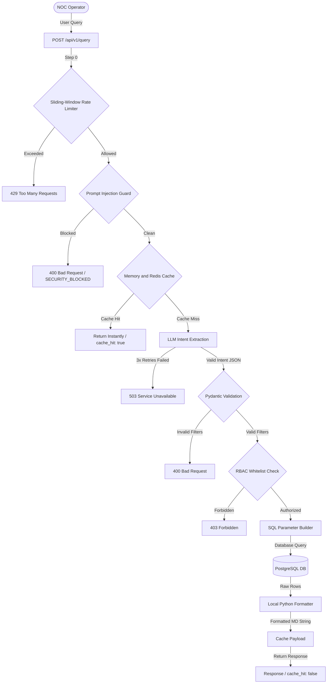

# 📋 Network AI Assistant - Master Implementation Plan

This document details the complete production-grade implementation architecture, design paradigms, security governance, and deployment details for the **Network Operations Center (NOC) AI Operations Assistant**. It serves as the primary system design reference for technical leaders, operations teams, and client stakeholders.

---

## 🛠️ 1. Executive Summary & Vision

### What We Are Building
An internal, zero-latency chat and automation interface designed specifically for network operations teams. Instead of logging into separate management dashboards, running raw database lookups, or raising manual helpdesk tickets, operators can type natural language queries (e.g., *"Which routers are down?"* or *"Show CPU utilization above 80%"*) and receive immediate, human-readable answers compiled from real-time database schemas.

### Business Value & Operational Efficiency
Traditional troubleshooting is historically bottlenecked by tribal knowledge and manual dashboard diving:
1. **Slow Triage:** Operators manually cross-reference disconnected device and interface metrics.
2. **Access Barriers:** Diagnostic queries require deep database read-only SQL knowledge.
3. **Queue Wait Times:** Simple telemetry lookups are forced to wait in queue on engineer tickets.

The Network AI Assistant automates data retrieval, filters it through a robust security grid, and returns highly detailed formatting to deliver safe network metrics in **under 3 seconds** (and **~1ms** on cached lookups).

---

## 🏗️ 2. Comprehensive System Architecture

The application is structured into three highly decoupled service layers:
1. **Frontend Portal (React + Vite + Tailwind CSS):** A premium, high-fidelity dark terminal console simulating real-time NOC environment styling.
2. **Backend API Gateways (FastAPI + Python):** An asynchronous, high-speed controller coordinating rate limiting, security filtering, LLM processing, SQL formulation, and localized formatting.
3. **Telemetry Database (PostgreSQL 16):** Hardened relational schema with dual-role user isolation and optimized indexing paths.

### Telemetry Pipeline Lifecycle Diagram

The sequence below illustrates how a query progresses from the operator's browser, through the FastAPI safety controllers, down to the PostgreSQL database, and back.



---

## 🔒 3. Enterprise Security & Governance

A fundamental requirement of enterprise networking applications is absolute security. The system utilizes five layers of defensive hardening to ensure data integrity and query safety.

### 3.1 Rate Limiting Grid
To prevent Denial of Service (DoS) or brute-force prompt attacks, the API enforces a sliding-window rate limiter per user session. It is handled in-memory within the Uvicorn worker process utilizing a double-ended queue (`deque`) tracking timestamps over a 60-second window. Any violation immediately returns an `HTTP 429 Too Many Requests` error, halting downstream LLM or database processing.

### 3.2 Prompt Injection & Schema Guard
Before natural language input is dispatched to Google Gemini, it is passed through the system's **Prompt Injection Guard** (`prompt_guard.py`). The query is normalized (lowercase, collapsed whitespaces) and matched case-insensitively against active signature rules:

| Security Pattern Regex | Label Identifier | Defensive Purpose |
| :--- | :--- | :--- |
| `ignore\s+(previous\|all\|above)\s+instructions` | `instruction_override` | Prevents system role bypass attempts |
| `reveal\s+(system\|your\|the)\s+prompt` | `prompt_extraction` | Blocks prompt leakage exploits |
| `what\s+is\s+(your\|the)\s+system\s+prompt` | `prompt_extraction` | Blocks prompt leakage exploits |
| `\bdrop\s+table\b` | `sql_injection` | Blocks raw SQL drop tables |
| `\bdelete\s+(from\|database)\b` | `sql_injection` | Blocks data deletion commands |
| `\btruncate\s+table\b` | `sql_injection` | Blocks table truncation commands |
| `\bunion\s+(all\s+)?select\b` | `sql_injection` | Blocks classic UNION-based database dumps |
| `\binformation_schema\b` | `schema_probe` | Prevents scanning system directories |
| `\bpg_catalog\b` | `schema_probe` | Prevents scanning PostgreSQL directories |
| `\bpg_tables\b` | `schema_probe` | Prevents scanning tables metadata |
| `\bshow\s+(tables\|schema\|databases)\b` | `schema_probe` | Blocks metadata discovery commands |
| `\bbypass\s+(security\|auth\|validation)\b` | `bypass_attempt` | Halts access bypass declarations |
| `you\s+are\s+now\s+` | `role_override` | Prevents LLM system role impersonation |
| `;\s*(drop\|delete\|insert\|update\|truncate)` | `chained_sql` | Prevents appended query executions |
| `--\s*$` | `sql_comment` | Blocks SQL query escaping comments |

> [!WARNING]
> **Audit Trail Integrity:** When a block occurs, the system logs a high-severity security warning with a 16-character query hash and commits a security block record to the `audit_log` database table with the detail `"BLOCKED:{pattern_type}"`.

### 3.3 Role-Based Access Control (RBAC) Whitelist Matrix
API routing mandates strict JWT-based session checks. The extracted query intent is cross-referenced with a whitelisted permission matrix (`roles.py`) mapping active roles to enabled intents:

| Query Intent | Admin | Network Operator | Network Engineer | Security Team |
| :--- | :---: | :---: | :---: | :---: |
| `device_status` | ✅ | ✅ | ✅ | ✅ |
| `device_inventory` | ✅ | ✅ | ✅ | ✅ *(Firewalls Only)* |
| `interface_metrics` | ✅ | ✅ | ✅ | ❌ |
| `device_metrics` | ✅ | ✅ | ✅ | ❌ |
| `config_changes` | ✅ | ✅ | ✅ | ❌ |
| `active_alerts` | ✅ | ✅ | ❌ | ✅ |
| `alert_summary` | ✅ | ✅ | ✅ | ✅ |
| `device_uptime` | ✅ | ✅ | ✅ | ❌ |

Any unauthorized intent match immediately aborts execution, returning an `HTTP 403 Forbidden` error.

### 3.4 Zero-SQL LLM Generation & Parameterized SQL Builders
To eliminate prompt injection and query hallucinations (the LLM making up non-existent columns or writing destructive commands), **the Generative AI never writes SQL**.
- **Gemini's Role:** Translated exclusively to structured JSON filters (NLP to filter parameters).
- **SQL Builder's Role:** A deterministic local Python compiler (`sql_builder.py`) loads static templates and builds SQL.
- **Parametric Binding:** The SQL queries use bound parameters (e.g., `:status`, `:severity`, `:threshold`). Never concatenate query strings with parameters.
- **Dual PostgreSQL Roles:**
  - **Read-Only Telemetry Role:** Authorized solely for `SELECT` operations on data tables. Denied writing or DDL capabilities.
  - **Audit-Write Role:** Authorized solely to `INSERT` into the `audit_log` table. Completely blocked from selecting or altering core networking tables.

---

## 🗄️ 4. Relational Database Schema Design

The operational network telemetry database runs on **PostgreSQL 16**. Data layouts are normalized and optimized using localized indexes.

### Relational Entity Model

```
       ┌────────────────────────┐
       │       locations        │
       └────────────────────────┘
                    ▲
                    │ 1-to-many
       ┌────────────────────────┐
       │        devices         │
       └────────────────────────┘
         ▲          ▲          ▲
         │          │          │
         │ (1:M)    │ (1:M)    │ (1:M)
   interfaces  metrics   config_changes
```

### Table Structure Definitions & Constraints

```sql
-- 1. Locations Table (Geographic deployment sites)
CREATE TABLE locations (
    id          SERIAL PRIMARY KEY,
    site_name   VARCHAR(100) NOT NULL,
    site_code   VARCHAR(20) UNIQUE NOT NULL,
    address     TEXT,
    created_at  TIMESTAMPTZ DEFAULT NOW()
);

-- 2. Devices Table (NOC Assets Inventory)
CREATE TABLE devices (
    id            SERIAL PRIMARY KEY,
    hostname      VARCHAR(255) UNIQUE NOT NULL,
    ip_address    INET NOT NULL,
    device_type   VARCHAR(50) NOT NULL DEFAULT 'router',
    vendor        VARCHAR(100),
    model         VARCHAR(100),
    os_version    VARCHAR(100),
    serial_number VARCHAR(100),
    location_id   INTEGER REFERENCES locations(id),
    status        VARCHAR(20) NOT NULL DEFAULT 'unknown',
    last_seen     TIMESTAMPTZ,
    created_at    TIMESTAMPTZ DEFAULT NOW(),
    updated_at    TIMESTAMPTZ DEFAULT NOW(),
    CONSTRAINT ck_devices_device_type CHECK (device_type IN ('router', 'switch', 'firewall', 'ap', 'load_balancer')),
    CONSTRAINT ck_devices_status CHECK (status IN ('up', 'down', 'degraded', 'unknown'))
);

-- 3. Interfaces Table (Device Physical Port Telemetry)
CREATE TABLE interfaces (
    id              SERIAL PRIMARY KEY,
    device_id       INTEGER REFERENCES devices(id) ON DELETE CASCADE,
    interface_name  VARCHAR(100) NOT NULL,
    status          VARCHAR(20) NOT NULL DEFAULT 'down',
    speed_mbps      INTEGER,
    description     TEXT,
    ip_address      INET,
    packet_loss_pct NUMERIC(5,2) DEFAULT 0,
    error_count     INTEGER DEFAULT 0,
    utilization_pct NUMERIC(5,2) DEFAULT 0,
    last_updated    TIMESTAMPTZ DEFAULT NOW(),
    CONSTRAINT uq_interfaces_device_interface UNIQUE(device_id, interface_name)
);

-- 4. Device Metrics Table (CPU / Memory / Uptime Snapshots)
CREATE TABLE device_metrics (
    id             SERIAL PRIMARY KEY,
    device_id      INTEGER REFERENCES devices(id) ON DELETE CASCADE,
    cpu_usage      NUMERIC(5,2),
    memory_usage   NUMERIC(5,2),
    uptime_seconds BIGINT,
    temperature_c  NUMERIC(5,1),
    recorded_at    TIMESTAMPTZ DEFAULT NOW()
);

-- 5. Configuration Audit Logs
CREATE TABLE config_changes (
    id          SERIAL PRIMARY KEY,
    device_id   INTEGER REFERENCES devices(id) ON DELETE CASCADE,
    changed_by  VARCHAR(100) NOT NULL,
    change_type VARCHAR(50),
    summary     TEXT,
    diff_hash   VARCHAR(64),
    changed_at  TIMESTAMPTZ DEFAULT NOW()
);

-- 6. Alerts & Alarms Grid
CREATE TABLE alerts (
    id          SERIAL PRIMARY KEY,
    device_id   INTEGER REFERENCES devices(id) ON DELETE CASCADE,
    severity    VARCHAR(20) NOT NULL,
    alert_type  VARCHAR(100),
    message     TEXT,
    is_active   BOOLEAN DEFAULT TRUE,
    created_at  TIMESTAMPTZ DEFAULT NOW(),
    resolved_at TIMESTAMPTZ,
    CONSTRAINT ck_alerts_severity CHECK (severity IN ('critical', 'warning', 'info'))
);

-- 7. Security & Activity Audit Log Table
CREATE TABLE audit_log (
    id            SERIAL PRIMARY KEY,
    user_id       VARCHAR(100) NOT NULL,
    user_question TEXT NOT NULL,
    parsed_intent JSONB,
    sql_executed  TEXT,
    row_count     INTEGER,
    latency_ms    INTEGER,
    error_message TEXT,
    created_at    TIMESTAMPTZ DEFAULT NOW()
);
```

### Performance Indexing Strategy
To guarantee sub-millisecond query execution speeds under high data density, the database utilizes structured indexing paths:
- `idx_devices_device_type` & `idx_devices_status` optimize standard inventory categorization.
- `idx_alerts_severity` & `idx_alerts_is_active` speed up incident reporting dashboards.
- `idx_device_metrics_recorded_at` provides immediate access to the most recent CPU and memory snapshots.
- `idx_audit_log_user_id` & `idx_audit_log_created_at` facilitate instant rendering of security audit trails.

---

## ⚡ 5. NLP Intent Extraction & Performance Caching

### 5.1 Google Gemini Flash Resiliency
On cache misses, the natural language prompt is parsed using **Google Gemini Flash**.
- **Hyperparameter Tuning:** Strict generation is enforced using `temperature=0`, `top_p=0.1`, and `max_output_tokens=300`.
- **JSON Sanitization:** The engine automatically strips formatting fences (e.g. ````json ... ````) returned by the model before decoding.
- **Fail-Safe Retry Loops:** Gemini calls are wrapped in a 3-attempt synchronous retry loop with progressive backoff delays (`0s` $\rightarrow$ `0.5s` $\rightarrow$ `1.0s`) to tolerate rate limits or API hiccups. Any permanent failure is mapped gracefully to an polite `503 Service Unavailable` API message.

### 5.2 Two-Tier Performance Cache
To maximize speed and contain LLM cost boundaries, a rolling cache is mounted:
- **30-Second Telemetry TTL:** Standardizes the cache lifecycle to guarantee fresh network data.
- **Auto-Discovery Redis Caching:** Discovers and binds Redis connection URLs automatically for multi-container deployments.
- **Local In-Memory Fallback:** Safely falls back to local Python cache structures if Redis goes offline, preventing service disruptions.

### 5.3 Local Python Formatting Templates
Raw database records are formatted into beautiful, standard Markdown directly in python (`response_templates.py`) in **<1ms**. This eliminates the secondary, expensive, and slow LLM formatting call, preserving a sub-millisecond response pipeline.
- *Uptime Formatting Example:* Translates raw seconds into standardized readable days, hours, and minutes (`Xd Xh Xm`).

---

## 🖥️ 6. NOC Frontend Operations Center Portal

The React frontend utilizes professional design conventions to deliver a highly interactive, responsive dark terminal environment.

```
┌──────────────────────────────────────────────────────────────────────────────┐
│  ⬤ AI READY   ⬤ DB ONLINE           Role: NOC_OPERATOR      Latency: 480ms  │
├──────────────────────────────────────────────────────────────────────────────┤
│                                                                              │
│  [Empty Chat Workspace / Suggested Incident Metrics Cards]                    │
│  - "Which routers are down?"                                                 │
│  - "Show devices with CPU usage above 80%"                                   │
│  - "List active critical alerts"                                             │
│                                                                              │
├──────────────────────────────────────────────────────────────────────────────┤
│  > Ask the network assistant...                                   [Submit]   │
└──────────────────────────────────────────────────────────────────────────────┘
```

### 6.1 Observability Header Pills
The top navigation bar acts as a live health board for systems monitoring:
- **AI Readiness Badge:** Green pulsing dot + `"AI ONLINE"`.
- **Database Connectivity Badge:** Cyan pulsing dot + `"DB CONNECTED"`.
- **Active Operator Role Badge:** Distinct coloring indicating logged-in role level (e.g., standard operator in blue `NOC_OPERATOR`, administrator in red `ADMIN`).
- **Performance Latency Indicator:** Tracks the latency of the last executed query in milliseconds. Color-coded dynamically to indicate processing health:
  - **Green (< 1000ms):** Highly optimized cache or fast database hits.
  - **Yellow (1000ms - 3000ms):** Standard intent extraction.
  - **Red (> 3000ms):** High latency API delays.
  - **Dashed Line (`—`):** Resting state when no query has run.

### 6.2 Granular Process-Timing Badging
Underneath every response bubble, a collapsible telemetry badge maps out the processing time:
- **Intent Extraction:** Time spent parsing the natural language with Gemini.
- **Pydantic Validation:** Microsecond verification times of the schema boundaries.
- **Database Query:** Query execution delay against PostgreSQL.
- **Deterministic Response Formatting:** Pure Python Markdown builder conversion time.
- **Total Process Latency:** Accumulation of the above sub-processes.

### 6.3 Smart Axios Error Interceptors
The frontend trap errors using custom Axios response interceptors. Instead of throwing raw stack exceptions or system modal popups:
- Translates `400`, `401`, `403`, `429`, `503`, or connection offline events directly into clean, contextually color-coded status alerts inside the chat timeline feed.

---

## 🚀 7. Setup, Installation & Verification Guide

### 7.1 Containerized Deployment via Docker
Deploy the entire suite (PostgreSQL, Redis, Backend API, Frontend Portal) with one command:

```bash
# 1. Clone the project structure
cd network-ai-assistant

# 2. Configure environments
cp .env.example .env
# Edit .env to set GEMINI_API_KEY=your_key

# 3. Boot container orchestration
docker compose up --build -d
```

Apply database schemas and seed initial telemetry:
```bash
# Apply database migrations
docker compose exec db alembic upgrade head

# Seed diagnostic telemetry records
docker compose exec backend python -m backend.app.db.seed
```

### 7.2 Manual Local Development Setup

For hot-reloading code environments:

#### Backend API
```bash
# Install Python dependencies
pip install -r backend/requirements.txt

# Run migrations and seed data
alembic upgrade head
python -m backend.app.db.seed

# Start FastAPI reload server
uvicorn backend.app.main:app --reload
```

#### Frontend Portal
```bash
# Install packages
cd frontend
npm install

# Start Vite live reload server
npm run dev
```

---

## 🧪 8. Validation & Testing Standards

### 8.1 Execution of Test Protocols
Run the automated test matrix to verify backend controls, query decorators, and route protection:

```bash
# Run pytest tests
pytest backend/tests
```

### 8.2 Development Coding Guidelines
To keep code quality high and clean, we enforce strict linters:
- **Python Backend:** Syntactic verification using **Ruff** with a strict **100-character** line-length boundary. All public modules must use standard **Google-Style Docstrings**.
- **React Frontend:** Standard **Functional Components** verified by ESLint. Styling is configured using utility-first **Tailwind CSS**.
- **Conventional Commits:** Git logs must adhere strictly to conventional guidelines:
  - `feat: ...` for new capabilities.
  - `fix: ...` for telemetry bugs or API exceptions.
  - `docs: ...` for Markdown and architectural additions.
